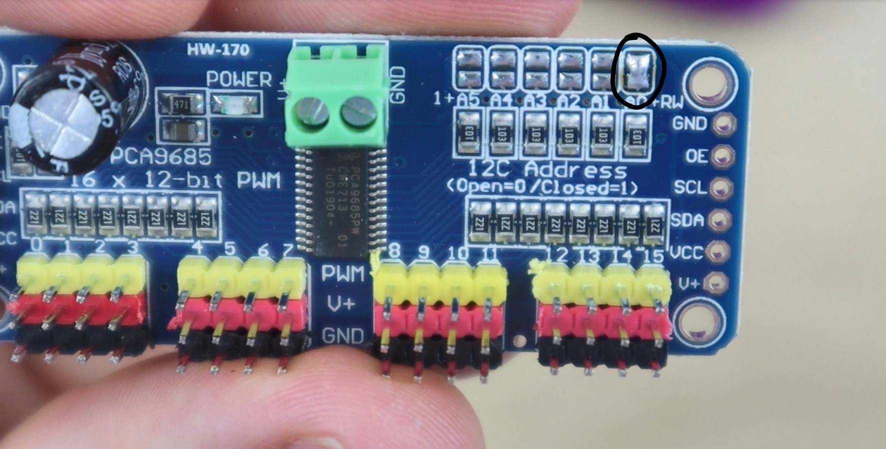

# Kinetic mirror - an interactive installation

## Materials used
<ul>
<li>
    32 Micro Servomotor SG90 90°
</li>
<li>
    Arduino Uno board
</li>
<li>
    32 mirror panels
</li>
<li>
    2 PCA PWM boards
</li>
<li>
    2 external power sources
</li>
</ul>

## Prerquisites
1. Clone this repository and make you have Arduino and Max installed
2. Install the Servo library and the Adafruit PWM Servo Driver library

## Wiring up Arduino Uno to the first PWM boards
Arduino | PWM board 1 | Info | 
--- | --- | --- 
GND | GND | Ground 
A5 | SCL | Serial Clock 
A4 | SDA | Serial Data 
5V | VCC | Power

## Wiring up the two PWM boards
PWM board 1 | PWM board 2 | Info | 
--- | --- | --- 
GND | GND | Ground 
OE | OE | Output Enable
SCL | SCL | Serial Clock 
SDA | SDA | Serial Data
VCC | VCC | Power
V+ | V+ | Power

<b>!!</b> both PWM board share the same address (0x40), in order to differentiate between the two of them change the address to 0x41 on the second one by souldering a bridge across the first terminals on the right, just like in the picture below:
 

## Wiring up the motors and the external power source to the PWM boards
The wires on the motors are pretty self explenatory and resemble the colors on the board, the brown wire goes to ground and the orange wire is the PWM signal.
For powering up the servo motors I recommend using a 5V power supply (no higher than 6V) with a minimum of 9-10A (depending on the number of servo motors and how frequent you want to move them). Below is a simple calculation (thanks to https://github.com/aaronse/servo-display/discussions/11), to get an idea of how much 16 motors consume:
~10ma * 16 servos = 160ma when idle (common scenario)
~250ma * 16 servos = 4A if continuous motion (rare scenario. Expect subset of 16 servos moving, and slow movements at any given time).
~750ma * 16 servos = 12A if all fully stalled (Should never happen, but… Code Bugs… So will happen when software has bug(s)).

In my case, I used two power supplies (not really recommended), each attached to its own PWM board. The red wire goes into the left inlet while the other wire goes into the other input.

If you want to see the full detailed diagram, check diagram.fzz.

## Demo
Plug in the Arduino board and the power supplies, load the script (from the motors_script folder) and open the Max patch (jweb-hands-landmarker/jweb-hands-landmarker.maxpat). 
<b>!!! When opening up the patch you will see a [serial c 115200] component, press on print to see all the available ports and modify the letter in the component corresponding to the port that Arduino is using (so in my case c: usbm_modem xxx was the port Arduino was communicating on). !!!
!!! If you choose to change the baud rate, make sure you also change it in the Max patch !!!</b>

